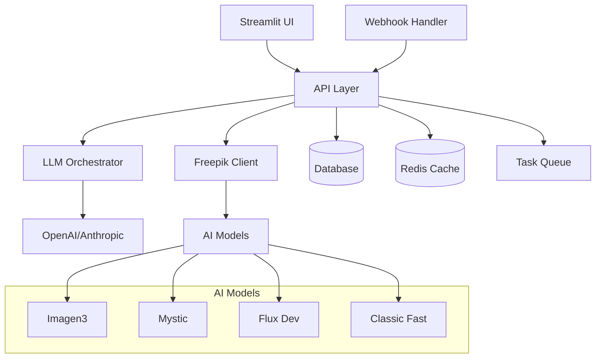
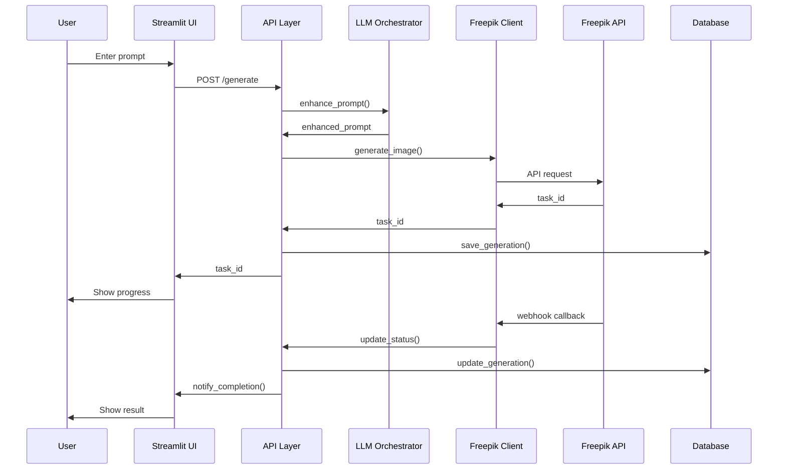

# Architecture Overview

Learn about the technical architecture and design principles behind the Freepik AI Orchestrator.

## System Architecture

The Freepik AI Orchestrator follows a modular, microservices-inspired architecture designed for scalability, maintainability, and extensibility.

### High-Level Architecture



### Core Components

#### 1. User Interface Layer

**Streamlit Frontend**
- Interactive web interface
- Real-time updates and feedback
- Responsive design
- Custom CSS styling

**Key Features:**
- Image generation interface
- Gallery management
- Analytics dashboard
- Settings and configuration

#### 2. API Layer

**FastAPI Backend**
- RESTful API endpoints
- Async request handling
- Input validation and sanitization
- Rate limiting and authentication

**Endpoints:**
- `/generate` - Image generation
- `/status/{task_id}` - Status checking
- `/workflows` - Workflow management
- `/analytics` - Usage analytics

#### 3. LLM Orchestrator

**Prompt Enhancement Engine**
- Multi-provider LLM support (OpenAI, Anthropic)
- Intelligent prompt optimization
- Context-aware enhancements
- Model selection logic

**Features:**
- Prompt analysis and categorization
- Technical detail injection
- Style and quality optimization
- Provider fallback mechanisms

#### 4. Freepik Integration

**API Client**
- Robust API communication
- Error handling and retries
- Webhook processing
- Result caching

**Capabilities:**
- Multi-model support
- Async generation handling
- Progress tracking
- Image downloading and storage

#### 5. Post-Processing Pipeline

**Image Enhancement**
- AI-powered upscaling
- Background manipulation
- Lighting adjustments
- Style transfers

**Processing Chain:**
- Input validation
- Enhancement application
- Quality optimization
- Output formatting

#### 6. Data Layer

**Database (PostgreSQL/SQLite)**
- Generation history
- User preferences
- Analytics data
- Workflow configurations

**Caching (Redis)**
- API response caching
- Session state management
- Temporary data storage
- Rate limiting counters

## Design Principles

### 1. Modularity

Each component is designed as an independent module with clear interfaces:

```python
# Clear separation of concerns
class LLMOrchestrator:
    """Handles LLM interactions"""
    
class FreepikClient:
    """Manages Freepik API communication"""
    
class PostProcessor:
    """Handles image post-processing"""
```

### 2. Async-First Design

Built for high-concurrency scenarios:

```python
# Async operations throughout
async def generate_image(prompt: str) -> dict:
    enhanced_prompt = await llm_orchestrator.enhance_prompt(prompt)
    result = await freepik_client.generate_async(enhanced_prompt)
    return result
```

### 3. Configuration Management

Environment-based configuration with validation:

```python
from pydantic import BaseSettings

class Settings(BaseSettings):
    freepik_api_key: str
    openai_api_key: Optional[str]
    database_url: str = "sqlite:///app.db"
    
    class Config:
        env_file = ".env"
```

### 4. Error Handling

Comprehensive error handling with user-friendly messages:

```python
class FreepikOrchestratorError(Exception):
    """Base exception with error codes"""
    
class APIError(FreepikOrchestratorError):
    """API-specific errors with retry logic"""
```

### 5. Observability

Built-in logging, metrics, and monitoring:

```python
import structlog

logger = structlog.get_logger()

@metrics.timer("generation.duration")
async def generate_image(prompt: str):
    logger.info("Starting generation", prompt=prompt)
    # ... generation logic
    logger.info("Generation completed", task_id=task_id)
```

## Data Flow

### 1. Image Generation Flow



### 2. Data Storage Strategy

**Hot Data (Active Operations)**
- Redis cache for active tasks
- Session state in memory
- Real-time metrics

**Warm Data (Recent History)**
- PostgreSQL for recent generations
- User preferences and settings
- Analytics aggregates

**Cold Data (Archive)**
- Cloud storage for images
- Long-term analytics data
- Backup and compliance data

### 3. Caching Strategy

**Multi-Level Caching**

```python
# L1: Application cache
@lru_cache(maxsize=100)
def get_prompt_template(category: str) -> str:
    return load_template(category)

# L2: Redis cache
@cache.memoize(timeout=3600)
def get_model_capabilities(model: str) -> dict:
    return fetch_model_info(model)

# L3: CDN cache
# Static assets and generated images
```

## Scalability Considerations

### Horizontal Scaling

**Stateless Design**
- No server-side session storage
- Shared state in Redis/Database
- Load balancer friendly

**Container Architecture**
```yaml
# Multiple API instances
api:
  replicas: 3
  resources:
    limits:
      cpu: "1"
      memory: "2Gi"

# Separate worker processes
worker:
  replicas: 5
  resources:
    limits:
      cpu: "500m"
      memory: "1Gi"
```

### Vertical Scaling

**Resource Optimization**
- Async I/O for API operations
- Connection pooling for database
- Memory-efficient image processing
- CPU optimization for LLM operations

### Database Scaling

**Read Replicas**
```python
# Read from replica for analytics
analytics_engine = create_engine(ANALYTICS_DB_URL)

# Write to primary for operations
operations_engine = create_engine(PRIMARY_DB_URL)
```

**Partitioning Strategy**
```sql
-- Partition generations by date
CREATE TABLE generations_2024_01 PARTITION OF generations
FOR VALUES FROM ('2024-01-01') TO ('2024-02-01');
```

## Security Architecture

### Authentication & Authorization

**API Key Management**
```python
class APIKeyAuth:
    async def authenticate(self, api_key: str) -> User:
        # Validate and return user context
        pass
```

**Role-Based Access Control**
```python
class RBACMiddleware:
    def check_permissions(self, user: User, resource: str, action: str) -> bool:
        return user.has_permission(resource, action)
```

### Data Protection

**Encryption at Rest**
- Database encryption
- File system encryption
- Secrets management

**Encryption in Transit**
- TLS 1.3 for all communications
- Certificate pinning
- HSTS headers

**Input Validation**
```python
from pydantic import BaseModel, validator

class GenerationRequest(BaseModel):
    prompt: str
    model: Optional[str]
    
    @validator('prompt')
    def validate_prompt(cls, v):
        if len(v) > 1000:
            raise ValueError('Prompt too long')
        return sanitize_input(v)
```

## Monitoring and Observability

### Metrics Collection

**Application Metrics**
```python
from prometheus_client import Counter, Histogram

generation_counter = Counter('generations_total', 'Total generations')
generation_duration = Histogram('generation_duration_seconds', 'Generation time')

@generation_duration.time()
async def generate_image(prompt: str):
    generation_counter.inc()
    # ... generation logic
```

**Business Metrics**
- Generation success rate
- User engagement metrics
- Cost per generation
- Model performance metrics

### Logging Strategy

**Structured Logging**
```python
import structlog

logger = structlog.configure(
    processors=[
        structlog.stdlib.add_log_level,
        structlog.processors.JSONRenderer()
    ]
)

logger.info(
    "Generation started",
    user_id=user_id,
    prompt_length=len(prompt),
    model=model
)
```

### Health Checks

**Application Health**
```python
@app.get("/health")
async def health_check():
    checks = {
        "database": await check_database(),
        "redis": await check_redis(),
        "freepik_api": await check_freepik_api(),
        "llm_provider": await check_llm_provider()
    }
    
    status = "healthy" if all(checks.values()) else "unhealthy"
    return {"status": status, "checks": checks}
```

## Development Architecture

### Code Organization

```
freepik-ai-orchestrator/
├── core/                    # Core business logic
│   ├── llm_orchestrator.py
│   ├── freepik_client.py
│   └── post_processor.py
├── api/                     # API layer
│   ├── routes/
│   ├── middleware/
│   └── dependencies.py
├── ui/                      # User interface
│   ├── components/
│   ├── pages/
│   └── styles/
├── database/                # Data layer
│   ├── models.py
│   ├── migrations/
│   └── db.py
├── config/                  # Configuration
│   ├── settings.py
│   └── logging.py
├── utils/                   # Utilities
│   ├── image_utils.py
│   └── prompt_templates.py
└── tests/                   # Test suite
    ├── unit/
    ├── integration/
    └── e2e/
```

### Testing Strategy

**Unit Tests**
```python
def test_prompt_enhancement():
    orchestrator = LLMOrchestrator()
    result = orchestrator.enhance_prompt("cat")
    assert len(result) > len("cat")
    assert "cat" in result.lower()
```

**Integration Tests**
```python
async def test_full_generation_flow():
    async with TestClient() as client:
        response = await client.post("/generate", 
                                   json={"prompt": "test"})
        assert response.status_code == 200
        task_id = response.json()["task_id"]
        
        # Wait for completion
        result = await wait_for_completion(task_id)
        assert result["status"] == "completed"
```

**End-to-End Tests**
```python
def test_ui_generation_flow():
    with pytest_streamlit.run_app():
        # Simulate user interaction
        st.text_input("prompt").send_keys("test prompt")
        st.button("Generate").click()
        
        # Verify UI updates
        assert st.success.called
```

### CI/CD Pipeline

**Build Process**
```yaml
# .github/workflows/build.yml
name: Build and Test
on: [push, pull_request]

jobs:
  test:
    runs-on: ubuntu-latest
    steps:
      - uses: actions/checkout@v2
      - name: Setup Python
        uses: actions/setup-python@v2
        with:
          python-version: 3.11
      - name: Install dependencies
        run: pip install -r requirements.txt
      - name: Run tests
        run: pytest tests/
      - name: Build Docker image
        run: docker build -t freepik-orchestrator .
```

**Deployment Process**
- Automated testing on all branches
- Staging deployment on develop branch
- Production deployment on main branch
- Rollback capabilities
- Blue-green deployment strategy

## Performance Optimizations

### Database Optimization

**Query Optimization**
```sql
-- Efficient pagination
SELECT * FROM generations 
WHERE created_at < ?
ORDER BY created_at DESC 
LIMIT 50;

-- Proper indexing
CREATE INDEX idx_user_created ON generations(user_id, created_at);
```

**Connection Pooling**
```python
from sqlalchemy.pool import QueuePool

engine = create_engine(
    DATABASE_URL,
    poolclass=QueuePool,
    pool_size=20,
    max_overflow=30,
    pool_timeout=30
)
```

### Async Processing

**Task Queue**
```python
from celery import Celery

celery_app = Celery('freepik_orchestrator')

@celery_app.task
async def process_generation(task_id: str):
    # Background processing
    pass
```

**Batch Operations**
```python
async def batch_generate(prompts: List[str]) -> List[dict]:
    tasks = [generate_image(prompt) for prompt in prompts]
    results = await asyncio.gather(*tasks)
    return results
```

### Caching Optimization

**Smart Cache Invalidation**
```python
from functools import wraps

def cache_with_invalidation(timeout=3600):
    def decorator(func):
        @wraps(func)
        async def wrapper(*args, **kwargs):
            cache_key = f"{func.__name__}:{hash(args)}"
            result = await redis.get(cache_key)
            
            if result is None:
                result = await func(*args, **kwargs)
                await redis.setex(cache_key, timeout, result)
            
            return result
        return wrapper
    return decorator
```

## Future Architecture Considerations

### Microservices Migration

**Service Boundaries**
- User Management Service
- Generation Service
- Analytics Service
- Notification Service

**Service Communication**
- REST APIs for synchronous communication
- Message queues for async communication
- Event sourcing for data consistency

### Event-Driven Architecture

**Event Bus**
```python
class EventBus:
    async def publish(self, event: Event):
        # Publish to all subscribers
        pass
    
    async def subscribe(self, event_type: str, handler: Callable):
        # Register event handler
        pass
```

**Domain Events**
```python
@dataclass
class GenerationCompleted(Event):
    task_id: str
    user_id: str
    image_url: str
    model_used: str
```

This architecture provides a solid foundation for building a scalable, maintainable, and high-performance AI image generation platform. The modular design allows for easy extension and modification as requirements evolve.
