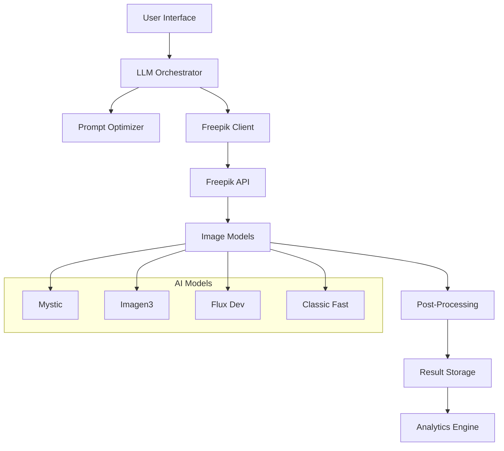

# 🎨 Freepik AI Orchestrator

Welcome to the **Freepik AI Orchestrator** documentation! This is a professional AI-powered image generation platform with LLM optimization for the Freepik API, built with Streamlit for a beautiful, interactive user experience.

## What is Freepik AI Orchestrator?

The Freepik AI Orchestrator is a comprehensive platform that bridges the gap between user creativity and AI-powered image generation. It leverages Large Language Models (LLMs) to optimize prompts and orchestrates multiple AI models to deliver exceptional image generation results.

## ✨ Key Features

-   :robot:{ .lg .middle } **LLM-Powered Prompt Engineering**

    ---

    Automatically optimizes prompts for better results using advanced language models

-   :dart:{ .lg .middle } **Multi-Model Support**

    ---

    Supports Mystic, Imagen3, Flux Dev, and Classic Fast models

-   :arrows_counterclockwise:{ .lg .middle } **Post-Processing Pipelines**

    ---

    Upscaling, relighting, style transfer, and background removal

-   :bar_chart:{ .lg .middle } **Real-time Analytics**

    ---

    Track usage, success rates, and costs with comprehensive dashboards

-   :art:{ .lg .middle } **Professional UI**

    ---

    Clean Streamlit interface with custom styling and intuitive controls

-   :zap:{ .lg .middle } **Async Processing**

    ---

    Webhook-based result handling for efficient processing

-   :lock:{ .lg .middle } **Production Ready**

    ---

    Docker support, environment management, and scalable architecture

-   :moneybag:{ .lg .middle } **Business Intelligence**

    ---

    Comprehensive analytics and reporting for business insights

## Quick Navigation

!!! tip "Getting Started"
    New to Freepik AI Orchestrator? Start with our [Installation Guide](installation.md) and [Quick Start](quickstart.md) tutorial.

!!! info "For Developers"
    Check out our [API Reference](api.md) and [Architecture Guide](development/architecture.md) for technical details.

!!! note "For Business Users"
    Learn about our [Business Model](business/model.md) and [Pricing Structure](business/pricing.md).

## Architecture Overview

## Community & Support

- **Documentation**: You're reading it! 📚
- **Issues**: Report bugs and request features on [GitHub Issues](https://github.com/yourusername/freepik-ai-orchestrator/issues)
- **Discussions**: Join the conversation on [GitHub Discussions](https://github.com/yourusername/freepik-ai-orchestrator/discussions)
- **Contributing**: Read our [Contributing Guide](development/contributing.md)

## License

This project is licensed under the MIT License. See the LICENSE file for details.

---

Ready to get started? Head over to the [Installation Guide](installation.md) to begin your journey with Freepik AI Orchestrator!
